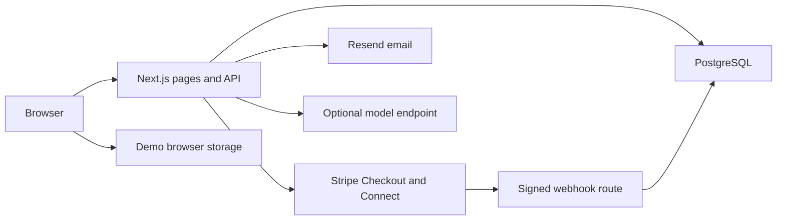

# Fairstage

[](https://github.com/kandulanikhilvarma/fairstage/actions/workflows/ci.yml)
[](LICENSE)

**Good interviews. Fair pay.**

[Open the live demo](https://fairstage.vercel.app) · [Deployment record](docs/DEPLOYMENT.md)

Fairstage is an open-source app for paid interview rounds.
Employers set a clear amount, duration, and scope.
Candidates accept the terms before the employer funds the round.
Both people confirm completion before payment release.

> Public pilot: demo mode. Fictional records. No real payments.
> The live API needs the service accounts and checks in [the launch guide](docs/LAUNCH.md).

## Product model

Candidates keep completed-round pay regardless of the hire decision.
The employer pays the platform fee. Candidates pay no platform fee.
The app never deducts a first salary or creates a repayment debt.

| Proposed round | Duration | Candidate pay |
| --- | --- | --- |
| Introduction | 30 minutes | $15 |
| Skills interview | 60 minutes | $45 |
| Work sample | 90 minutes | $90 |

The Launch fee is 8% of candidate pay.
A $45 round costs the employer $48.60 before applicable tax.
The platform absorbs payment processing costs in this release.
The product plan proposes Team and Scale cost models. The release has no paid subscriptions.

The bonus calculator explores a credit against a separate signing bonus.
The calculator does not create payroll instructions. Bonus terms also need local review.

## Features

- Public site, pricing calculator, pay policy, and job board.
- Employer and candidate workspaces with separate account roles.
- Jobs, applications, round offers, acceptance, and completion records.
- Stripe Connect account setup and employer Checkout.
- Signed webhooks, replay protection, row locks, and provider idempotency keys.
- Payment ledger, CSV export, disputes, and audit events.
- Email verification and password reset through Resend.
- Optional OpenAI-compatible adapter for an open-weight model.
- Local interview preparation guide without an external model.
- Mobile layouts, keyboard focus, reduced motion, and accessibility checks.

The release does not include SSO, team seats, calendar sync, ATS sync, or automatic dispute resolution.
See [the roadmap](docs/ROADMAP.md) for later work.

## Quick start

Use Node.js 22 and npm 10 or later.

```sh
git clone https://github.com/kandulanikhilvarma/fairstage.git
cd fairstage
npm ci
npm run dev
```

Open `http://localhost:3000`.
Demo mode works without credentials or a database.
Switch roles in the workspace to test both sides.
Use Reset demo to restore the fictional records.

## Live setup

1. Copy `.env.example` to `.env.local`.
2. Start PostgreSQL with `docker compose up -d`.
3. Set the database URL and exact app URL.
4. Run the migration with the environment file.
5. Set `DEMO_MODE=false`.
6. Set the email service and Stripe test credentials.
7. Complete [the launch checks](docs/LAUNCH.md).

```sh
node --env-file=.env.local --import tsx scripts/migrate.ts
npm run dev
```

`LIVE_PAYMENTS_ENABLED=false` blocks money movement by default.
Only enable payments after a successful Stripe test-account review.
The owner must choose an operating company and supported countries.
Global product scope does not imply global payment coverage.

## Verification

```sh
npm run check
npx playwright install chromium
npm run test:e2e
```

Unit tests check prices, validation, password hashes, and demo state changes.
API tests use an actual PostgreSQL engine through PGlite and a mocked payment provider.
They check ownership, transactions, event replay, and failure recovery.
Browser tests check round flows, applications, exports, accessibility, and viewport fit.
GitHub CI also applies the migration to PostgreSQL 17.

Mocked provider tests do not prove that a commercial Stripe account can process payments.
Live account, payout, refund, and dispute checks remain part of launch approval.

## Architecture



See [architecture](docs/ARCHITECTURE.md), [API](docs/API.md), and [money rules](docs/MONEY.md) for details.

## Documentation

| Guide | Purpose |
| --- | --- |
| [Product plan](docs/PLAN.md) | Scope, pilot prices, and delivery stages |
| [Design system](DESIGN.md) | Brand tokens, type, layout, and component rules |
| [Money rules](docs/MONEY.md) | Fees, payment states, refunds, and recovery limits |
| [Launch guide](docs/LAUNCH.md) | Service accounts and acceptance checks |
| [Operator guide](docs/OPERATIONS.md) | Disputes, backups, incidents, and privacy requests |
| [AI guide](docs/AI.md) | Open-weight model adapter and consent |
| [Roadmap](docs/ROADMAP.md) | Future features with release gates |
| [Evaluation](docs/EVALUATION.md) | Actual checks and known limits |

## License

The code uses the [MIT License](LICENSE).
Model weights, payment services, and third-party packages keep their own licenses and terms.
The Fairstage name has no trademark clearance yet.

---

[LinkedIn](https://www.linkedin.com/in/nikhilvarmakandula) · [Email](mailto:kandulanikhilvarma@gmail.com) · [Portfolio](https://kandula.studio)
