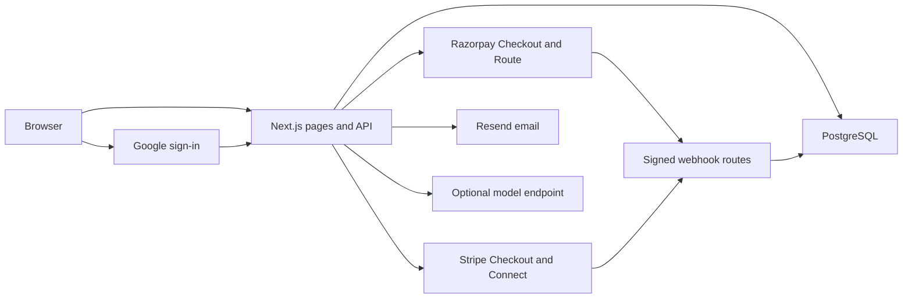

# Fairstage

[](https://github.com/kandulanikhilvarma/fairstage/actions/workflows/ci.yml)

**Good interviews. Fair pay.**

[Open Fairstage](https://fairstage.vercel.app) · [Deployment record](docs/DEPLOYMENT.md)

Fairstage helps employers pay people for interview time.
Employers specify the amount, duration, and scope of each round.
Candidates accept the terms before the employer funds the round.
Both people confirm completion before the provider transfers candidate pay.

Accounts and records use PostgreSQL.
The app shows service availability from its configuration.
An unavailable provider cannot create payment records or transfers.
See [the launch guide](docs/LAUNCH.md) for service setup and acceptance checks.

## Product model

Candidates keep completed-round pay regardless of the hire decision.
The employer pays the platform fee. Candidates pay no platform fee.
The app does not deduct wages or create a repayment debt.

| Proposed USD round | Duration   | Candidate pay |
| ------------------ | ---------- | ------------- |
| Introduction       | 30 minutes | $15           |
| Skills interview   | 60 minutes | $45           |
| Work sample        | 90 minutes | $90           |

The Launch plan has no monthly fee and an 8% platform fee.
A $45 round has a $48.60 employer total before any applicable tax.
Payment providers charge processing fees. A free account does not mean free payment processing. [Razorpay pricing](https://razorpay.com/pricing/).
The release applies the Launch fee. Team and Scale prices remain proposals without subscription billing.

Employers can choose USD or INR for a role or round.
INR uses approved Razorpay Route accounts.
USD uses Stripe Connect only where Stripe approves the platform and transfer model.
The app keeps currency totals separate. The app does not convert USD prices to INR.
Provider approval determines the supported countries and payment methods.

The bonus calculator shows a possible credit against a separate signing bonus.
The calculator does not create payroll instructions. Bonus terms need local legal review.

## Features

- Public prices, pay policy, job search, and two interview templates.
- Google sign-in, email sign-in links, and password accounts.
- Separate employer and candidate workspaces with server sessions.
- Profiles with skills, portfolio links, resume links, and time zones.
- Role publication, applications, applicant search, and manual application states.
- Round offers, acceptance, calendar downloads, and private notes.
- Razorpay Checkout and approved Route transfers for INR rounds.
- Stripe Checkout and connected account setup for USD rounds.
- Signed webhooks, event replay protection, ownership checks, and row locks.
- Payment records, currency-aware CSV export, account export, and disputes.
- Stable pagination and complete account totals beyond the first page.
- Restricted operator review with audited notes and concurrent-edit checks.
- Authenticated daily maintenance and a credential-free readiness report.
- Email verification and password reset through Resend.
- Optional open-weight AI service with explicit consent.
- Local interview preparation without an external model.
- Responsive layouts, visible controls, keyboard focus, and reduced motion.

Google sign-in needs OAuth credentials.
Email links need a verified sender.
Payment setup needs approved merchant accounts and candidate verification.
The interface keeps unavailable actions separate from completed transactions.

The release has no team seats, calendar sync, ATS sync, or automatic dispute decisions.
See [the roadmap](docs/ROADMAP.md) for later features and their acceptance gates.
See [the first-stage delivery](docs/FIRST_STAGE.md) for completed scope and deferred activation.

## Local setup

Use Node.js 22 and npm 10 or later.

```sh
git clone https://github.com/kandulanikhilvarma/fairstage.git
cd fairstage
npm ci
```

1. Copy `.env.example` to `.env.local`.
2. Start PostgreSQL with `docker compose up -d`.
3. Set `DATABASE_URL` for the local database.
4. Set `APP_URL` to `http://localhost:3000`.
5. Apply the migrations.
6. Start the development server.

```sh
node --env-file=.env.local --import tsx scripts/migrate.ts
npm run dev
```

Open `http://localhost:3000`.
Create a candidate or employer account with an email address and a password.
Email verification and external sign-in methods need their service credentials.
The preparation guide works without a model account.
The examples page explains two round formats without account data.

## Production configuration

The app needs a managed PostgreSQL database and an exact `APP_URL`.
The deployment keeps server credentials outside the repository.
Google, Resend, Razorpay, Stripe, and the model endpoint have separate credentials.

Both payment flags start disabled.
Enable each provider only after its acceptance checks pass.
Razorpay Route also needs merchant approval and verified linked accounts.
Stripe India does not support this release's separate charges and transfers.
Keep USD payments disabled for the India operator. [Stripe India marketplace limits](https://support.stripe.com/questions/stripe-india-support-for-marketplaces).
Production Stripe actions need an approved platform country outside India and explicit approval of the funds flow.

Global product scope does not imply global payment coverage.
Follow [the launch guide](docs/LAUNCH.md) before the commercial pilot.

## Verification

```sh
npm run check
npx playwright install chromium
npm run test:e2e
```

Unit tests check prices, validation, and password security.
API tests use PostgreSQL through PGlite with mocked providers.
Auth tests check real RSA signatures against test keys.
Browser tests use isolated accounts and a local database.
GitHub CI also applies the migrations to PostgreSQL 17.

Automated provider tests do not establish commercial payment approval.
Record real service acceptance separately in [the evaluation](docs/EVALUATION.md).

## Architecture



See [architecture](docs/ARCHITECTURE.md), [API](docs/API.md), and [money rules](docs/MONEY.md) for implementation details.

## Documentation

| Guide                                | Purpose                                            |
| ------------------------------------ | -------------------------------------------------- |
| [Product plan](docs/PLAN.md)         | Scope, prices, and release steps                   |
| [Design system](DESIGN.md)           | Brand tokens, type, layouts, and controls          |
| [Money rules](docs/MONEY.md)         | Fees, payment states, refunds, and provider limits |
| [Launch guide](docs/LAUNCH.md)       | Credentials, approval, and service checks          |
| [Operator guide](docs/OPERATIONS.md) | Disputes, backups, incidents, and privacy requests |
| [AI guide](docs/AI.md)               | Model adapter, data scope, and consent             |
| [Roadmap](docs/ROADMAP.md)           | Later features and release gates                   |
| [Evaluation](docs/EVALUATION.md)     | Verified results and pending checks                |
| [Deployment](docs/DEPLOYMENT.md)     | Production source and public-domain checks         |

## Source and rights

The repository exposes the source and product rules for review.
The current release does not include a project license file.
Confirm source reuse rights with the repository owner.
Dependencies, model weights, and external services keep their respective licenses and terms.

---

[LinkedIn](https://www.linkedin.com/in/nikhilvarmakandula) · [Email](mailto:kandulanikhilvarma@gmail.com) · [Portfolio](https://kandula.studio)
