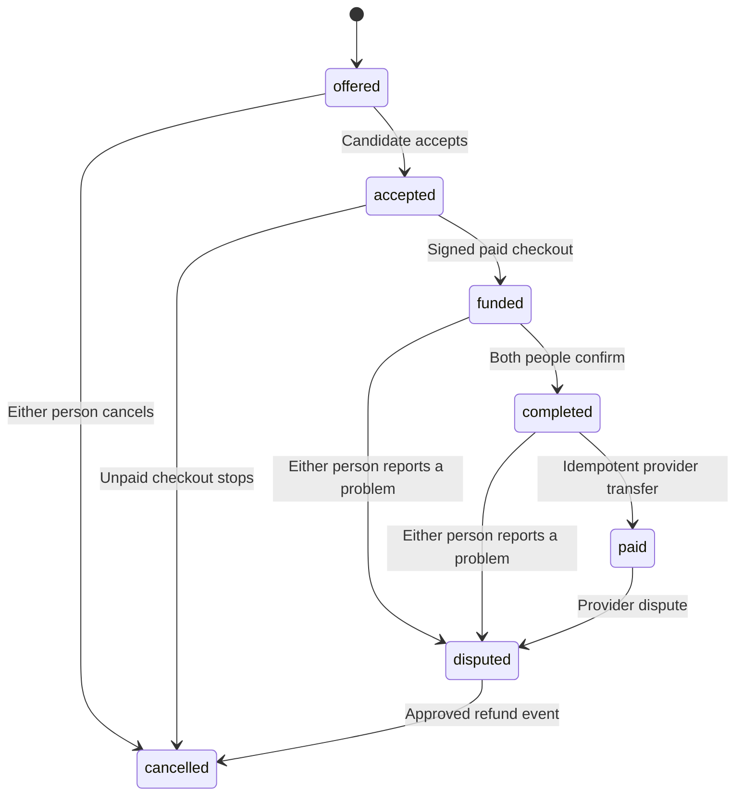

# Architecture

## Runtime

Next.js serves the public pages, workspace, and route handlers.
The browser gets its mode from `/api/config`.
Demo mode is the default. The owner must set `DEMO_MODE=false` to enable real accounts.

Demo mode stores fictional records in browser storage.
The demo refuses real account and money writes at the API boundary.
The local preparation guide does not call an external model.

Live mode uses PostgreSQL and server sessions.
The browser cannot choose its live role. The stored account determines the role.
Each protected query checks the actor and resource owner.

## Modules

| Module | Purpose |
| --- | --- |
| `lib/domain.ts` | Types, validation, prices, and permitted state changes |
| `lib/security.ts` | Password hashes, session cookies, origin checks, and rate limits |
| `lib/payments.ts` | Connect setup, checkout, release, and event processing |
| `lib/db.ts` | PostgreSQL pool and transactions |
| `lib/demo.ts` | Fictional records and demo state changes |
| `lib/ai.ts` | Optional model endpoint adapter |
| `app/api/[...path]/route.ts` | Public and protected API routes |
| `app/api/webhooks/stripe/route.ts` | Signed Stripe event intake |
| `db/001_initial.sql` | Tables, indexes, and money constraints |

## Data model

Users own jobs or receive round offers.
Applications link a candidate to a job.
Rounds link an employer and candidate to immutable pay terms.
Ledger entries record provider events with unique references.
Disputes stop release. Audit events record the actor and action.

## Money states

The app locks the round row during each money write.
The provider transfer uses a stable idempotency key.
The database rejects duplicate provider references.
An external transfer can succeed before a database failure. A retry uses the same provider key to recover safely.

## Limits

Workspace queries return up to 200 rounds and payment events.
Jobs return up to 100 records. The release has no pagination UI.
An operator must add pagination before a larger deployment.

The release has no team membership model, SSO, ATS sync, or subscription billing.
Dispute resolution needs the operator runbook. No automatic adjudication exists.
