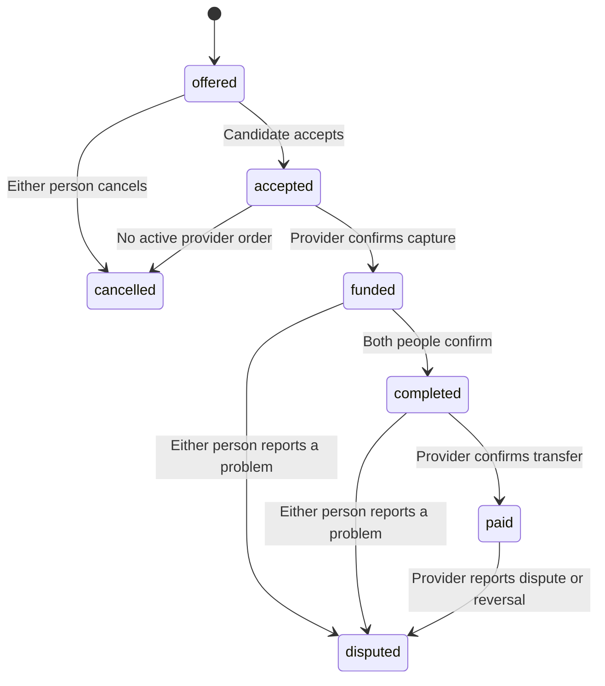

# Architecture

## Runtime

Next.js serves the public pages, workspace, and API routes.
PostgreSQL holds all account and workspace records.
The browser reads service availability from `/api/config`.
The stored user account determines the workspace role.
Each protected query checks the actor and resource owner.

Absent credentials disable the relevant service.
The app never substitutes browser records for account data.
The preparation guide uses local text when no model service exists.

## Modules

| Module                       | Purpose                                                        |
| ---------------------------- | -------------------------------------------------------------- |
| `lib/domain.ts`              | Types, validation, prices, currencies, and permitted states    |
| `lib/security.ts`            | Password hashes, sessions, origin checks, and rate limits      |
| `lib/auth.ts`                | Email sign-in links and service availability                   |
| `lib/google-auth.ts`         | Google authorization code flow and ID token checks             |
| `lib/payments.ts`            | Stripe account setup, checkout, release, and webhooks          |
| `lib/razorpay.ts`            | Razorpay orders, payment checks, Route transfers, and webhooks |
| `lib/db.ts`                  | PostgreSQL pool and transactions                               |
| `lib/queries.ts`             | Stable tenant pages and summaries over complete histories      |
| `lib/operator.ts`            | Restricted case review and append-only audit notes             |
| `lib/maintenance.ts`         | Authorized cleanup of expired temporary records                |
| `lib/readiness.ts`           | Configuration checks without credential values                 |
| `lib/calendar.ts`            | Calendar files for authorized interview participants           |
| `lib/templates.ts`           | Two public interview formats                                   |
| `lib/ai.ts`                  | Optional model service with consent                            |
| `app/api/[...path]/route.ts` | Public and protected business routes                           |
| `app/api/auth`               | Google and email sign-in routes                                |
| `app/api/webhooks`           | Signed provider events                                         |
| `db`                         | Ordered SQL migrations                                         |

## Authentication

Password accounts use salted scrypt hashes.
Session cookies contain random secrets with a seven-day expiry.
PostgreSQL stores each session secret as a SHA-256 hash.
Production cookies use Secure, HttpOnly, and SameSite=Lax.
Protected writes require the exact configured origin.
PostgreSQL stores rate limits across function instances.

Google sign-in uses authorization codes with PKCE.
An expiring challenge binds state and nonce to the requesting browser.
The server exchanges the code directly with Google.
Google discovery data supplies the authorization, token, and key endpoints.
The server restricts those endpoints to their expected HTTPS origins.

The server verifies the RSA signature, issuer, audience, expiry, and nonce of each ID token.
The permanent Google subject selects the same account on later sign-ins.
Gmail and managed Workspace claims can establish email ownership.
New identities with other Google email claims need an email link instead of automatic account linkage.
See [Google token verification](https://developers.google.com/identity/gsi/web/guides/verify-google-id-token).

Email sign-in links expire after 15 minutes.
The database stores only hashes of the link and browser secrets.
The account page needs an explicit confirmation POST to consume a link.
The link must open in the requesting browser.
The transaction consumes each link once.
Verified accounts keep their stored role and credentials.

The first verified claim revokes an unverified registrant's password, sessions, and recovery tokens.
The claim clears untrusted profile values and uses the proven owner's name and role.
Financial mappings remain intact.

Email advisory locks serialize ownership claims, password login, registration, and profile changes.
Each auth transaction inserts its session before commit.
Real PostgreSQL tests check claims against concurrent registration and password login.

## Data model

Users own jobs or receive interview offers.
Profiles contain optional skills, work links, and a time zone.
Applications link candidates to jobs.
Employers set application states manually; candidates can withdraw their own applications.
The API limits applicant profile data to the applicant and the relevant employer.

Rounds link one employer and one candidate to agreed pay terms.
The round currency selects the provider: INR for Razorpay and USD for Stripe.
Each participant can save a private note.
Calendar downloads require participation in the round.
Account exports contain records within the authenticated user's scope.
The workspace loads bounded pages with timestamp and UUID cursors.
The server computes totals over the complete authorized history.
The payment CSV queries the complete authorized ledger separately from the paginated workspace view.

Operator access needs a verified session and an exact server allowlist match.
The server checks the session again inside each review transaction.
An advisory lock serializes the first case review.
A version check rejects a stale edit.
Case notes remain separate from payment records and participant disputes.

The maintenance job uses a separate Bearer secret and a transaction lock.
Each run removes at most 1000 rows from each temporary table after a one-day expiry grace period.
The job preserves permanent account, payment, provider-event, and audit records.
The database records successful and failed runs without private error details.

Ledger entries record provider events with unique references.
Disputes stop payment release. Audit events record the actor and action.
The interface keeps currency totals separate.
The interface does not infer a spendable bank balance from the ledger.

## Payment states

The app locks the round row for payment writes.
Stripe transfers use stable idempotency keys.
Razorpay transfers keep a stable request body and request reference.
Provider events require a signature over the original request body.
The app checks captured amounts, currencies, orders, and recipients.
Unique event references prevent duplicate ledger records during replay.

Production Stripe actions need an approved platform country outside India and explicit approval of the funds flow.
Provider pause flags stop new money actions.
Signed webhook reconciliation continues during a pause.

A provider request can succeed before the database saves the result.
The release uses provider references to reconcile such requests.
An unresolved provider result needs operator review.
See [money rules](MONEY.md) and [operations](OPERATIONS.md).

## Browser and service boundaries

The browser never receives server API credentials.
Razorpay Checkout receives only its public key and order details.
Stripe uses a provider-hosted checkout and account setup.
The CSP permits the configured Razorpay script, connection, and frame origins.
The app denies external page frames and sends standard security headers.

The model service receives only the general topic and round type after consent.
The assistant cannot set application states or release pay.
The app has no automatic candidate score or hire decision.

## Limits

Workspace queries return bounded result sets.
The release has no pagination interface or team membership model.
The account export can include more records than the workspace view.
High-volume deployments need pagination and export load checks.

Route account approval needs an operator process.
The app does not accept arbitrary payout account identifiers from candidates.
Dispute decisions need the operator runbook.
Calendar files do not include calendar sync.
SSO, ATS sync, and subscription billing remain later releases.
